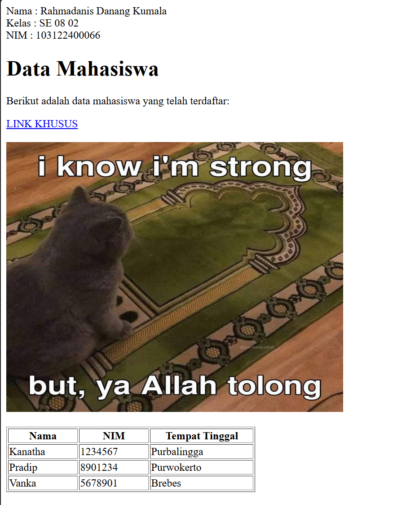
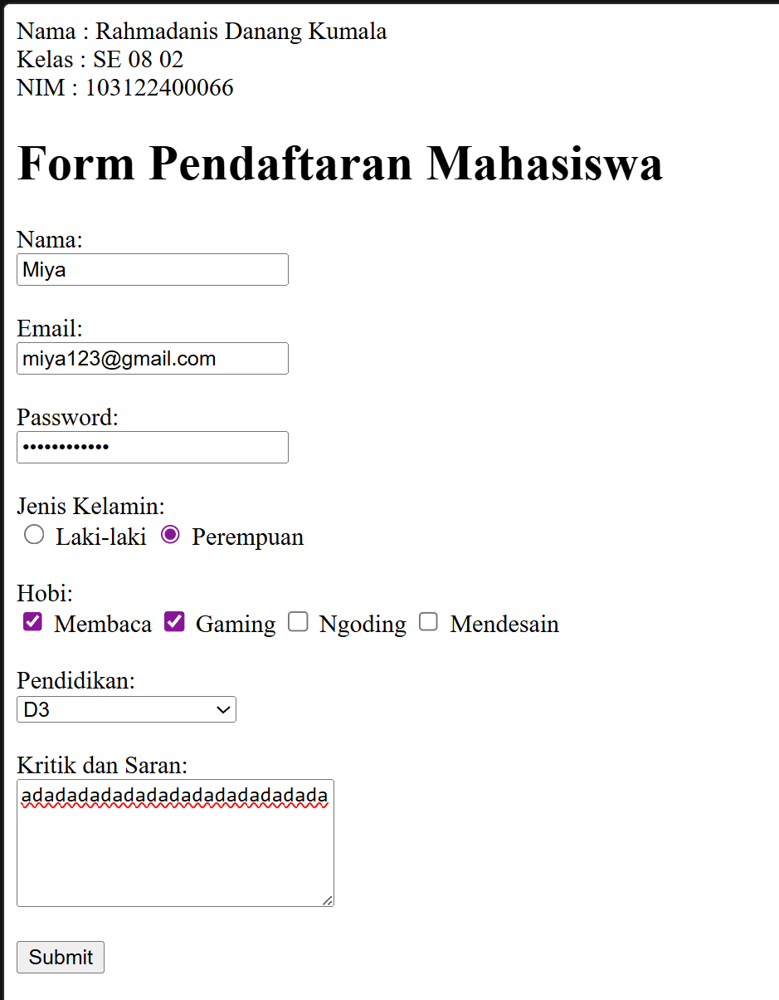

# MODUL 02 - HTML

### Nama : Rahmadanis Danang Kumala
### Kelas : SE 08 02
### NIM : 103122400066
### -----------------------------------------------

### SOAL 1 - Halaman Data Mahasiswa
Halaman ini dibuat dengan tema Data Mahasiswa dan memiliki beberapa komponen HTML dasar, yaitu:

1. Heading sebagai judul halaman
2. Paragraf singkat
3. Hyperlink menuju website lain
4. Gambar menggunakan elemen ``
5. Tabel data mahasiswa dengan minimal 3 baris dan 3 kolom

### OUTPUT 
**SOAL 1**

**SOAL 2**

### SOAL 2 - Form Pendaftaran 
Form pendaftaran mahasiswa dibuat menggunakan beberapa elemen HTML, yaitu:

1. Input Nama
2. Input Email
3. Input Password
4. Radio Button untuk Jenis Kelamin
5. Checkbox untuk Hobi
6. Dropdown untuk Pendidikan
7. Textarea untuk Kritik dan Saran
8. Tombol Submit

#### Note: `<label>` pada setiap input untuk mendukung aksesibilitas dasar